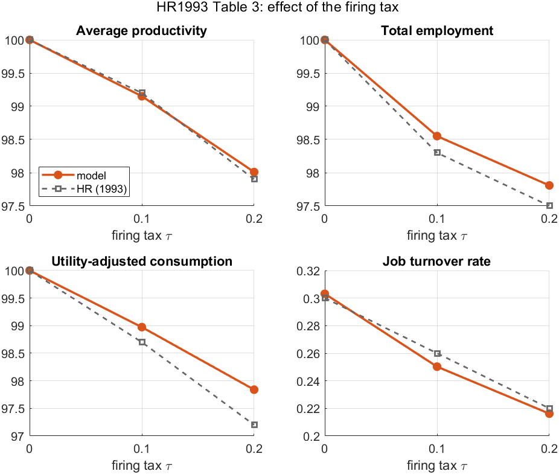

# firm-dynamics

MATLAB code for a family of **heterogeneous-firm dynamics models** in the
tradition of Hopenhayn (1992), Hopenhayn & Rogerson (1993), and Hopenhayn,
Neira & Singhania (2022). Every model is written with the **output price `p`
and the wage `w` explicit** (rather than the usual single relative price
`z = p/w`), fixes `p = 1` as the numeraire, and solves the free-entry condition
for the wage `w` with `fzero`.

## Contents

| Folder | Model | What it does |
|---|---|---|
| [`code/`](code/) | **HNS22 (2022)** recode | Rewrites the Hopenhayn–Neira–Singhania (2022) replication with `p, w` explicit; reproduces the published benchmark to machine precision. Original code in [`hns22_raw/`](hns22_raw/), tests in [`tests/`](tests/). |
| [`hopenhayn_1992/`](hopenhayn_1992/) | **Hopenhayn (1992)** | Lean single-type stationary firm-dynamics model (no labor-force growth, costs in goods). |
| [`hopenhayn_rogerson_1993/`](hopenhayn_rogerson_1993/) | **Hopenhayn & Rogerson (1993)** | Full replication with firing costs: a calibrated `τ=0` benchmark (Table 2), the 2-D `(s, n₋₁)` firing-cost model, and a representative household reproducing the job-turnover / productivity / welfare experiments (Table 3). |

## Highlights

- The **HNS22 recode** reproduces the original z-based benchmark to relative
  error `0` and passes a `(p,w)`-homogeneity test.
- The **Hopenhayn–Rogerson (1993)** replication reproduces Table 3 closely: a
  firing tax of one year's wages (`τ = 0.2`) **cuts job turnover ~30%**,
  **lowers average productivity ~2%**, and **costs ~2.2% of consumption in
  welfare** — the paper's headline result.



## Common design

All three folders share the same conventions:

- **Explicit prices.** The firm solves `max_n  p·s·n^θ − w·n − (fixed cost)`;
  `n.m` / `prof_fn.m` (or `return_fn.m`) state the first-order conditions with
  `p` and `w` explicit. Firm value is in dollars.
- **Numeraire + free entry.** Fix `p = 1`; the wage `w` clears free entry,
  `E[V(entrant)] = (entry cost)`, solved with `fzero` — mirroring the original
  HNS22 `zstar_fun`/`fzero` price solve.
- **Homogeneity.** Because the firm problem is homogeneous of degree 1 in
  `(p, w)`, real allocations depend only on `z = p/w`; fixing `p = 1` is a pure
  normalization, checked explicitly in each verification script.

Each folder is self-contained and has its own `README.md`, a `makefigs.m`
(result plots in `figures/`), and a verification / benchmark script.

## Layout

```
firm-dynamics/
├── code/                       HNS22 recoded with explicit p, w   (see code/README.md)
├── hns22_raw/                  original HNS22 replication code (reference, untouched)
├── data_summary_stats/         data series used by code/
├── tests/                      regression + homogeneity checks for code/
├── hopenhayn_1992/             Hopenhayn (1992) model             (see its README.md)
└── hopenhayn_rogerson_1993/    Hopenhayn & Rogerson (1993)        (see its README.md)
```

## Requirements

MATLAB (developed on R2024b). Uses base functions plus `normcdf`/`fzero`;
`normcdf` is from the Statistics and Machine Learning Toolbox. No other
dependencies. To run a model, `cd` into its folder and run the driver named in
that folder's README (e.g. `main`, `hr1993_2d`, `calibrate_benchmark`).

## References

- Hopenhayn, H. (1992). "Entry, Exit, and Firm Dynamics in Long Run
  Equilibrium." *Econometrica* 60(5).
- Hopenhayn, H. and Rogerson, R. (1993). "Job Turnover and Policy Evaluation:
  A General Equilibrium Analysis." *Journal of Political Economy* 101(5).
- Hopenhayn, H., Neira, J., and Singhania, R. (2022). "Firm Dynamics and the
  Declining Startup Rate." *Econometrica*.
